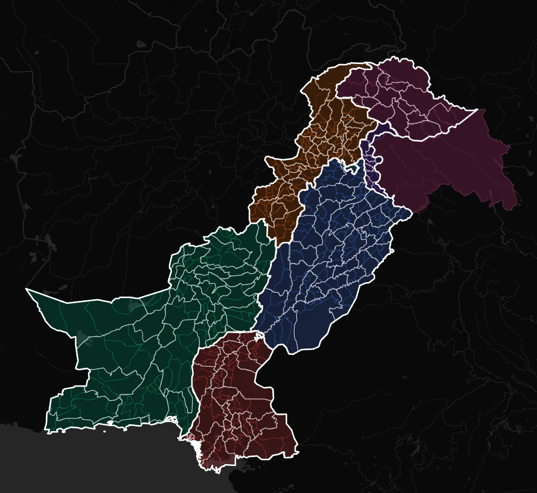

# Pakistan Interactive Map Explorer & Open GeoJSON Datasets 🇵🇰

An open-source, high-precision Web GIS interactive map and open data repository for Pakistan down to **Tehsil level (ADM3)**. Enriched with official **2023 Digital Census** statistics, major rivers, capital markers, multi-level layer controls, and PowerPoint-ready vector (SVG) / image (PNG) export tools.

🌐 **Live Web Application:** **[https://pakistan-map-explorer.web.app](https://pakistan-map-explorer.web.app)**

<p align="center">
  
</p>

100% Free and Open Source under the **MIT License** for academic, research, commercial, and personal use.

---

## 🌟 Key Features

* **Multi-Level Administrative Hierarchy:**
  * **Provinces & Territories (ADM1):** 7 main administrative divisions (Punjab, Sindh, KPK, Balochistan, AJK, GB, ICT).
  * **Districts (ADM2):** 160 Districts with parent province relationships.
  * **Tehsils (ADM3):** 554 Tehsils with spatial parent-child metadata (Province & District mapping).
* **📊 2023 Digital Census Data:**
  * Enriched with official figures from the **7th Population & Housing Census 2023 (Pakistan Bureau of Statistics)**.
  * Displays total population and calculated population density per km².
* **🏞️ Major Rivers Overlay:**
  * Clean vector tracing of the River Indus, Jhelum, Chenab, Ravi, and Sutlej.
* **🎨 Presentation-Ready Image & Vector Exporters:**
  * **Download as Image (PNG):** High-resolution transparent background map crop.
  * **Download as Vector (SVG):** 100% PowerPoint and Adobe Illustrator compatible. Drop directly into slides to click, ungroup, and recolor individual boundary shapes!
* **🛰️ Base Map Options:**
  * **None (Solid Dark):** Clean, floating vector map interface.
  * **Dark Map (CartoDB):** Dark mode basemap with international borders.
  * **Satellite Map (Esri):** High-resolution real earth satellite imagery background.
* **🔍 Instant Search Engine:**
  * Auto-completing A-Z search input to instantly fly to and highlight any Province, District, or Tehsil.

---

## 📁 Downloadable GeoJSON Datasets

All datasets are clean, valid GeoJSON files located in the `data/` directory. You can use them directly in Python, R, QGIS, ArcGIS, Mapbox, or Leaflet.

| Dataset | Level | Features | Key Attributes | Download Link |
| :--- | :--- | :--- | :--- | :--- |
| **Provinces** | ADM1 | 7 Regions | `adm1_name`, `pop_2023`, `pop_density`, `area_sqkm`, `center_lat`, `center_lon` | [`provinces.geojson`](data/provinces.geojson) |
| **Districts** | ADM2 | 160 Districts | `adm2_name`, `adm1_name` (Parent Province), `area_sqkm`, `center_lat`, `center_lon` | [`districts.geojson`](data/districts.geojson) |
| **Tehsils** | ADM3 | 554 Tehsils | `shapeName` (Tehsil), `adm2_name` (District), `adm1_name` (Province), `area_sqkm` | [`tehsils.geojson`](data/tehsils.geojson) |
| **Rivers** | Hydro | Major Rivers | `NAM` (River Name), `LENGTH_KM` | [`rivers.geojson`](data/rivers.geojson) |

---

## 🚀 How to Import Data in Code

### Python (GeoPandas)
```python
import geopandas as gpd

# Load Provinces with 2023 Census Data
provinces_url = "https://raw.githubusercontent.com/fatah/pakistan-interactive-map/main/data/provinces.geojson"
gdf_provinces = gpd.read_file(provinces_url)

# Print Punjab Census Population
punjab = gdf_provinces[gdf_provinces['adm1_name'] == 'Punjab']
print(f"Punjab 2023 Population: {punjab['pop_2023'].values[0]:,}")

# Load all 554 Tehsils with spatial parent attributes
tehsils_url = "https://raw.githubusercontent.com/fatah/pakistan-interactive-map/main/data/tehsils.geojson"
gdf_tehsils = gpd.read_file(tehsils_url)
print(gdf_tehsils[['shapeName', 'adm2_name', 'adm1_name']].head())
```

### JavaScript (Leaflet.js)
```javascript
fetch('data/tehsils.geojson')
  .then(response => response.json())
  .then(data => {
    L.geoJSON(data, {
      style: { color: '#3b82f6', weight: 0.5, fillOpacity: 0.2 },
      onEachFeature: (feature, layer) => {
        layer.bindTooltip(`${feature.properties.shapeName} (${feature.properties.adm2_name})`);
      }
    }).addTo(map);
  });
```

---

## 🛠️ Local Installation & Running

1. **Clone the repository:**
   ```bash
   git clone https://github.com/fatah/pakistan-interactive-map.git
   cd pakistan-interactive-map
   ```

2. **Serve locally using Python:**
   ```bash
   python3 -m http.server 8080
   ```

3. Open your browser and navigate to: `http://localhost:8080`

---

## 💼 Custom GIS Development & Paid Consulting

Need custom maps, specialized GIS dashboards, or private dataset integration for your organization?

We offer **custom web GIS development and tailored mapping services** for:
* 🏥 **NGOs & Health Campaigns:** Vaccination, disease tracking, and health facility mapping.
* 🏢 **Corporate & Logistics:** Branch coverage, supply chain routes, and sales region allocation.
* 📊 **Research & Polling:** Election constituency mapping, demographic analytics, and custom heatmaps.
* 🛰️ **Satellite Analysis:** Land use, agricultural yield, and flood damage mapping.

📬 **Get in touch for custom development:**  
* **Email:** `contact@pakistanmap.org` *(or your preferred email)*
* **Custom Requests:** Open an issue or discussion on this repository!

---

## 📜 License & Citation

This project is licensed under the **MIT License** - free to use, modify, distribute, and commercialize.

If you use this map or data in academic research, reports, or publications, please cite:
> **Pakistan Interactive Map Explorer & Open GeoJSON Datasets (2026)**  
> Data Sources: *Pakistan Bureau of Statistics (7th Digital Census 2023)*, *geoBoundaries*, *HDX*.
